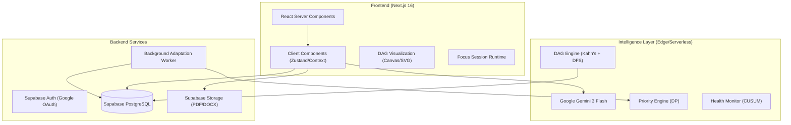
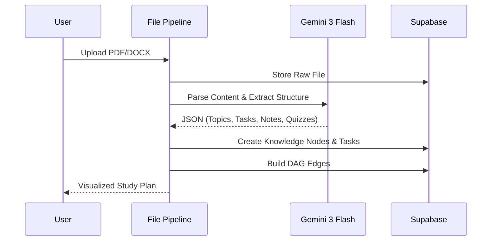

# Adaptive Study OS — Full System Specifications

Adaptive Study OS (code-named **AcadAI**) is a self-evolving, AI-powered academic intelligence system. It transforms static study materials into dynamic, dependency-aware learning graphs, continuously adapts to student behavior, and provides a context-aware AI tutor to optimize learning efficiency and retention.

---

## 1. System Architecture

The application follows a modern, full-stack architecture optimized for high-performance AI interactions and real-time state management.

### Core Technologies
- **Framework**: Next.js 16 (App Router)
- **Language**: TypeScript
- **Styling**: TailwindCSS + Framer Motion
- **Database**: Supabase (PostgreSQL with RLS)
- **AI**: Google Gemini 3 Flash
- **State Management**: React Context + LocalStorage Persistence
- **Visualization**: HTML5 Canvas / SVG

---

## 2. Intelligence Modules & Algorithms

### A. DAG (Directed Acyclic Graph) Engine
The system treats every learning objective as a node in a graph.
- **Node Hierarchy**: `Subject` -> `Topic` -> `Subtopic` -> `Task`.
- **Dependencies**: Tasks are blocked until all parent nodes are marked `done`.
- **Cycle Detection**: Uses Depth-First Search (DFS) with color-marking (White/Gray/Black) to prevent circular dependencies.
- **Topological Sort**: Implements Kahn's Algorithm to generate valid study sequences.

### B. Priority Formula
The system calculates a `priority` score (0-1) for every task using a weighted multi-factor formula:
$$priority = (0.4 \times CP) + (0.3 \times DU) + (0.2 \times DS) + (0.1 \times PI)$$
Where:
- **CP (Critical Path)**: Computed via bottom-up dynamic programming.
- **DU (Deadline Urgency)**: Time remaining vs. total required duration.
- **DS (Difficulty Score)**: 1 - rolling success rate.
- **PI (Procrastination Index)**: Derived from the number of times a task was skipped or delayed.

### C. Health Monitoring (CUSUM-based)
Analyzes user performance trends using Exponential Moving Average (EMA).
- **Recency Weighting**: $\alpha = 0.85$ (favors recent performance).
- **Trend Detection**: Compares performance in the first half of a sliding window vs. the second half to detect burnout or increasing difficulty before a failure occurs.
- **Threshold**: Triggers an automatic **Replanning Engine** if health drops below 0.4.

### D. Replanning Engine
Triggered by health declines or missed deadlines:
1. **Priority Boost**: Increases weight of failed tasks.
2. **Duration Compression**: Easy tasks are compressed to 70% duration (min 20m).
3. **Pruning**: Temporarily drops low-priority non-blocking tasks if the student is overloaded.

---

## 3. Core Workflows

### I. Knowledge Ingestion Workflow

### II. Study Session Cycle
1. **Selection**: User picks a "Ready" task from the dashboard.
2. **Focus Mode**: System triggers a timer and restricts UI to focus-related tools (Notes/Tutor).
3. **Execution**: User studies, takes notes, or asks the AI Tutor for help.
4. **Completion**: User logs results (felt difficulty, actual time).
5. **Feedback Loop**: System updates `TaskLog` and recalculates `UserBehavior` vectors.

### III. Adaptation Loop (Experience Replay)
- Runs every 8 hours via a Background Worker (`/api/worker`).
- Processes `TaskLogs` to update `success_rate`, `avg_session_time`, and `consistency_score`.
- Updates the **Master AI Model**'s context for future task generation and tutoring.

---

## 4. Data Model

| Entity | Key Attributes |
| :--- | :--- |
| **Tasks** | `dependencies[]`, `priority`, `critical_path_length`, `success_rate` |
| **User Behavior** | `procrastination_index`, `burnout_risk`, `consistency_score` |
| **Knowledge Nodes** | `node_type (topic/subtopic)`, `difficulty`, `mastery_level` |
| **Study Sessions** | `duration`, `difficulty_felt`, `interruption_count` |
| **AI Notes** | `linked_tasks[]`, `key_terms`, `simple_explanation` |

---

## 5. Deployment & Scalability

- **Platform**: Vercel (Edge Functions for API, Serverless for Worker).
- **Database**: Supabase Managed Postgres.
- **AI Latency**: Optimized using **Gemini 3 Flash** for sub-2s response times on complex parsing tasks.
- **Persistence**: Hybrid approach using Supabase for persistent state and LocalStorage for transient UI state (timer/current session).

---

## 6. Future Roadmap
- **Multimodal Learning**: Video-to-Task pipeline.
- **Collaborative DAGs**: Peer-to-peer study graph sharing.
- **Predictive Burnout**: Using LSTM/Transformer models on behavior vectors.
